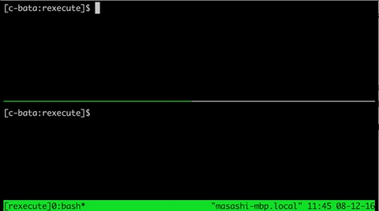

# rexecute

Re-execute the command when specified files are modified.

## Installation

```console
$ go install github.com/c-bata/rexecute
```

## Design

```console
$ find . -name "*.tex" | rexecute make build
```



## License

MIT License@Masashi Shibata

